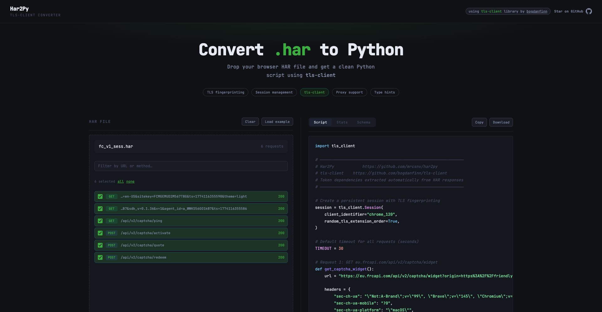

# Har2Py

Har2Py is a web-based tool designed to convert HTTP Archive (HAR) files into clean, ready-to-use Python scripts. It focuses on replicating browser-captured sessions into automated scripts using the **tls-client** library.

## Overview

Capturing and replicating complex web sessions can be a tedious process. Har2Py simplifies this by allowing developers to export sessions from a browser or MITM proxy (such as BurpSuite) and convert them directly into functional Python code. By analyzing the captured HAR data, Har2Py replicates the exact sequence of requests, including headers, cookies, and data payloads, ensuring high fidelity in the automated replication.

## Key Features

- **Session Replication**: Directly converts browser or proxy-captured traffic into Python scripts.
- **Token Dependency Analysis**: Automatically detects and extracts tokens (CSRF, Auth, Cookies) from responses and injects them into subsequent requests.
- **Session Management**: Maintains persistent sessions to handle cookies and headers automatically across multiple requests.
- **Client-Side Processing**: 100% of the processing happens in the browser. No HAR data or sensitive information is ever uploaded to a server.
- **Advanced Options**: Support for type hints, retry logic, proxy configuration, and custom timeouts.

## How It Works

1. **Capture**: Record a network session in your browser or through an MITM proxy like BurpSuite and export it as a .har file.
2. **Load**: Drop the file into Har2Py. The tool parses the JSON data locally.
3. **Filter**: Select the specific requests you want to include in your Python script.
4. **Configure**: Choose your target client profile and toggle options like session persistence or proxy support.
5. **Generate**: Click generate to receive a formatted Python script using the `tls-client` library.

## Objective

The primary goal of Har2Py is to streamline the process of moving from manual session analysis (via tools like BurpSuite) to automated Python scripts. By automating the extraction of headers, cookies, and complex token dependencies, it significantly reduces the manual effort required to replicate browser behavior in a standalone environment.

## Credits

- **tls-client library**: [https://github.com/bogdanfinn/tls-client](https://github.com/bogdanfinn/tls-client)

## License

This project is open-source and intended for educational and research purposes.
